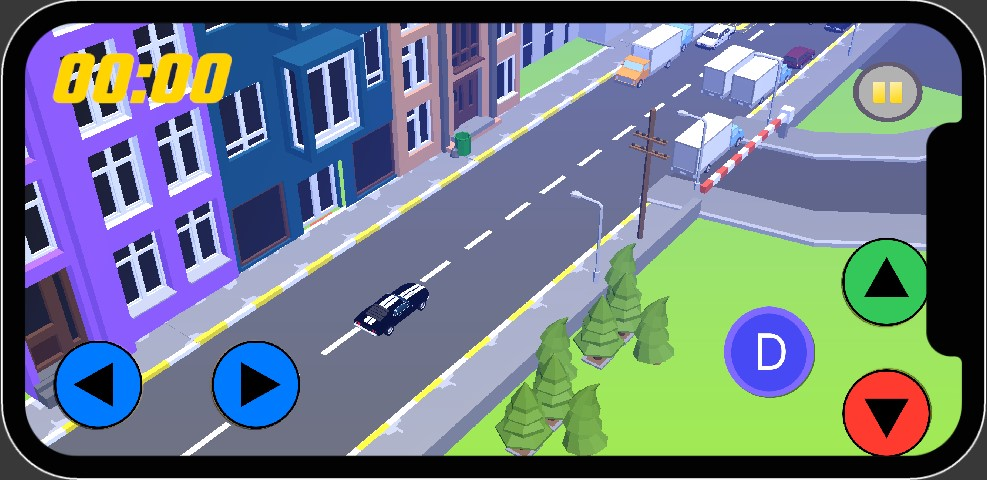
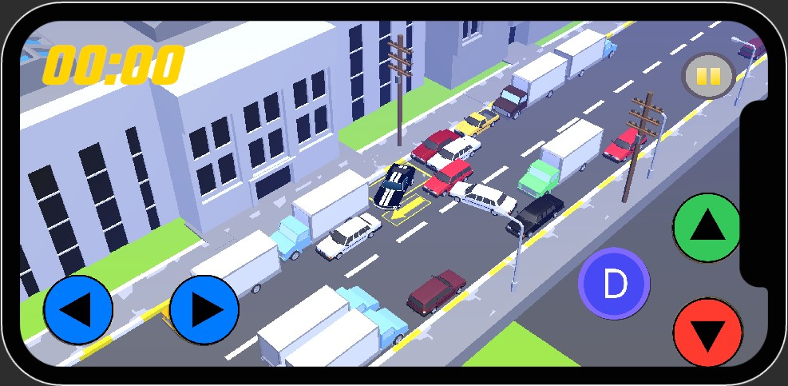
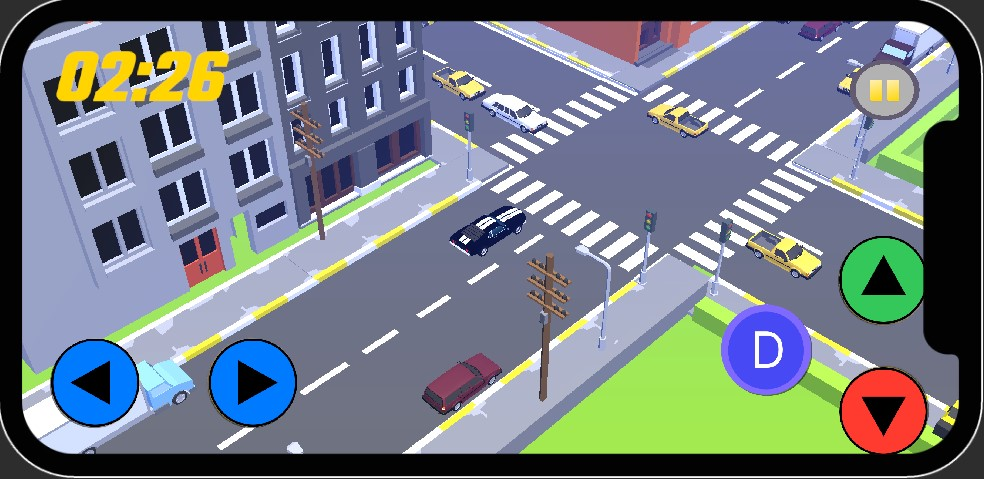
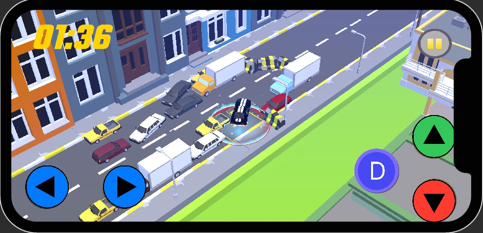
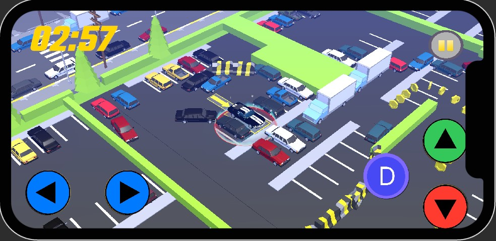
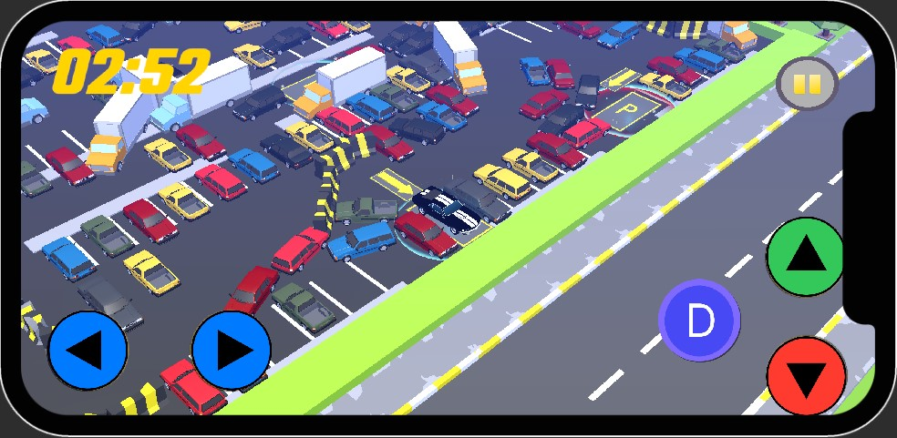

# Gridlock Rush: A Car Simulator Game

## Game Overview

**Gridlock Rush** is an engaging car simulation game where players navigate through challenging traffic scenarios. Test your driving skills, solve puzzles, and experience the thrill of overcoming gridlocks in style.


## Key Features

- **Low-Poly Style**  
  A charming and visually appealing low-poly art style designed for mobile platforms.

- **Easy and Fun Gameplay**  
  Enjoy an intuitive, easy-to-learn driving experience that’s perfect for players of all ages.

- **Realistic Traffic Simulation**  
  Navigate through dynamically changing traffic conditions while solving fun and engaging challenges.

- **Time Trial Mode**  
  Race against the clock to complete levels as quickly as possible, testing your driving skills under pressure.

- **Level System**  
  Progress through levels with increasing difficulty, unlocking new challenges and rewards as you advance.

- **Intuitive Controls**  
  Simple, responsive controls that make it easy for players to jump right in and enjoy the game.

  

## Game Details

- **Title**: Gridlock Rush
- **Version**: 1.0.0
- **Platform**: Android
- **Developer**: OPCD STUDIO
- **Release Date**: Coming soon on the Play Store!

## Gameplay Screenshots

### Primary Gameplay Images



---



---



### Additional Gameplay Images



---



---



## How to Play

1. Choose a level from the main menu.
2. Navigate through the traffic to reach your destination and park the car correctly.
3. Use in-game currency to unlock new upgrades.
4. Progress through levels to unlock harder challenges.

## System Requirements

### Minimum:

- **OS**: Android 8.0 (Oreo) or higher
- **Processor**: Quad-core 1.8 GHz or higher
- **Memory**: 2 GB RAM
- **Graphics**: Adreno 506 or similar
- **Storage**: 40 MB available space

### Recommended:

- **OS**: Android 10.0 (Q) or higher
- **Processor**: Octa-core 2.0 GHz or higher
- **Memory**: 4 GB RAM
- **Graphics**: Adreno 612 or similar
- **Storage**: 40 MB available space

## Development Roadmap

- **Future Updates**: Plans for new cars and additional level designs.
- **Player Feedback**: Your suggestions will shape upcoming features.

## Code Review

Before diving into the game's visual design and insights, it’s important to conduct a **Code Review** to ensure quality, maintainability, and optimization.

### 1. **Code Structure**:

### Use of `PlayerPrefs` in `LevelManager` Script

In the **`LevelManager`** script, we use **`PlayerPrefs`** to manage the progression of the levels the player has unlocked. Here's a breakdown of how **`PlayerPrefs`** is used:

```csharp
int levelsUnlocked = PlayerPrefs.GetInt("levelsUnlocked", 1);
Debug.Log("Levels Unlocked: " + levelsUnlocked);

foreach (Button button in buttons)
{
    button.interactable = false;
}

for (int i = 0; i < levelsUnlocked && i < buttons.Length; i++)
{
    buttons[i].interactable = true;
    Debug.Log($"Button {i} is interactable.");
}
```

### Use of `PlayerPrefs` in `LevelScript` for Unlocking New Levels

In the **`LevelScript`** script, we manage level progression and unlocking new levels when the player successfully completes a level. Here's how the process works:

```csharp
using System.Collections;
using System.Collections.Generic;
using UnityEngine;
using UnityEngine.SceneManagement;

public class LevelScript : MonoBehaviour
{
    public void Pass()
    {
        // Get the current level's index.
        int currentLevel = SceneManager.GetActiveScene().buildIndex;

        // If the player has completed this level and it's the highest level unlocked,
        // the next level gets unlocked.
        if (currentLevel >= PlayerPrefs.GetInt("levelsUnlocked"))
        {
            // Update the unlocked levels in PlayerPrefs.
            PlayerPrefs.SetInt("levelsUnlocked", currentLevel + 1);
        }

        // Log the newly unlocked level to the console.
        Debug.Log("LEVEL" + PlayerPrefs.GetInt("levelsUnlocked") + " UNLOCKED");
    }
}
```

### Use of `Navmesh AI` in vehicle tracking and traffic control

For this purpose built an AI system with using NavMesh AI.

Vehicle AI: Vehicles or cars navigating roads or streets while avoiding collisions.
AI Navigation for Games: Any other scenario where characters need to navigate through a 3D space and interact with obstacles.

```csharp
private NavMeshAgent navMeshAgent;

```

# Common Use Cases of UnityEngine.AI:

Enemy AI: Making enemies follow or chase the player while avoiding obstacles.
NPC Movement: Making NPCs move in the game world based on different objectives (patrolling, following, etc.).
Vehicle AI: Vehicles or cars navigating roads or streets while avoiding collisions.
AI Navigation for Games: Any other scenario where characters need to navigate through a 3D space and interact with obstacles.

```csharp
void Update()
{
    // Calculate the distance between the enemy and the player's car.
    float distanceToPlayer = Vector3.Distance(transform.position, playerCar.position);

    // If the enemy is close enough to the player (within detection range) and is not currently charging

    if (distanceToPlayer <= detectionRange && !isCharging)
    {
        // Start charging towards the player to collide
        StartCoroutine(Charge());
    }
    else if (distanceToPlayer <= rangeCheckDistance)
    {
        // If the enemy is within a slightly larger range, follow the player normally
        FollowPlayer();
    }
    else
    {
        // If the player is too far away, log a message (currently no other action is taken)
        Debug.Log("Player out of range, but no movement logic yet.");
    }
}

```

if the distance condition distanceToPlayer <= rangeCheckDistance then FollowPlayer() function called.The FollowPlayer() method makes the enemy follow the player's car while keeping a minimum distance. It calculates the direction to the player, adjusts the target position to stay behind the player by a specified distanceOffset, and then directs the enemy to that target using the NavMeshAgent. This ensures the enemy follows the player without getting too close.

```csharp
  private void FollowPlayer()
    {
        // Oyuncuyu takip et ama minimum bir mesafe (offset) bırak
        Vector3 directionToPlayer = (playerCar.position - transform.position).normalized;
        Vector3 targetPosition = playerCar.position - directionToPlayer * distanceOffset;
        navMeshAgent.SetDestination(targetPosition); // Yönü bu şekilde ayarla
    }

```

## `OnCollisionEnter` Method Explanation

The `OnCollisionEnter` method handles the behavior when the enemy collides with the player’s car while charging. Below is a breakdown of how it works:

### Code Breakdown:

````csharp
private void OnCollisionEnter(Collision collision)
{
    if (collision.gameObject.CompareTag("Player") && isCharging)
    {
        Rigidbody playerRb = collision.gameObject.GetComponent<Rigidbody>();

        if (playerRb != null)
        {
            // Calculate impact direction: from enemy to player
            Vector3 impactDirection = collision.transform.position - transform.position;
            impactDirection.y = 0; // Prevent movement along the Y-axis.
            impactDirection.Normalize();

            // Calculate the impact force based on the enemy's current speed
            float impactForce = navMeshAgent.velocity.magnitude * forceMultiplier;

            // Apply the calculated force to the player's car
            playerRb.AddForce(impactDirection * impactForce, ForceMode.Impulse);

            Debug.Log($"Player hit with force: {impactForce}");
        }
    }
}
### 2. **Performance Optimization**:

- Review how traffic simulation and physics calculations are handled to optimize performance, especially for mobile devices.
- Look for areas where memory usage can be reduced and frame rates improved, especially during intense traffic scenarios.
- Optimize loading times for smoother gameplay experience.

### 3. **Bug and Error Checking**:

- Ensure that all major gameplay features work smoothly, including traffic AI, car physics, and user interactions.
- Address any existing bugs or glitches in the game mechanics, particularly in time-sensitive challenges or parking sequences.

### 4. **Code Readability**:

- Ensure that variable names are meaningful, and code is well-documented for future developers.
- Simplify complex logic where possible to make it easier for new developers to understand and contribute.

### 5. **Testing**:

- Implement unit tests where applicable, especially for traffic behavior and car controls.
- Perform stress tests to ensure the game can handle multiple cars and dynamic traffic scenarios without performance degradation.

By conducting a thorough code review, we ensure that **Gridlock Rush** remains performant, bug-free, and ready for future development.

## Visual Insights


## Support

For assistance, reach out to our support team at [support email] or visit our [website link].

## Conclusion

Get ready to dive into the ultimate car simulation experience with **Gridlock Rush**. Master traffic puzzles, showcase your driving skills, and enjoy endless hours of fun!


---

# <Your-Project-Title>

## Description

Provide a short description explaining the what, why, and how of your project. Use the following questions as a guide:

- What was your motivation?
- Why did you build this project? (Note: the answer is not "Because it was a homework assignment.")
- What problem does it solve?
- What did you learn?

## Table of Contents (Optional)

If your README is long, add a table of contents to make it easy for users to find what they need.

- [Installation](#installation)
- [Usage](#usage)
- [Credits](#credits)
- [License](#license)

## Installation

What are the steps required to install your project? Provide a step-by-step description of how to get the development environment running.

## Usage

Provide instructions and examples for use. Include screenshots as needed.
To add a screenshot, create an `assets/images` folder in your repository and upload your screenshot to it. Then, using the relative filepath, add it to your README using the following syntax:

```md

````
