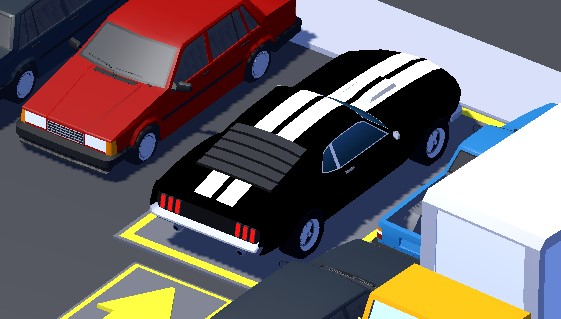
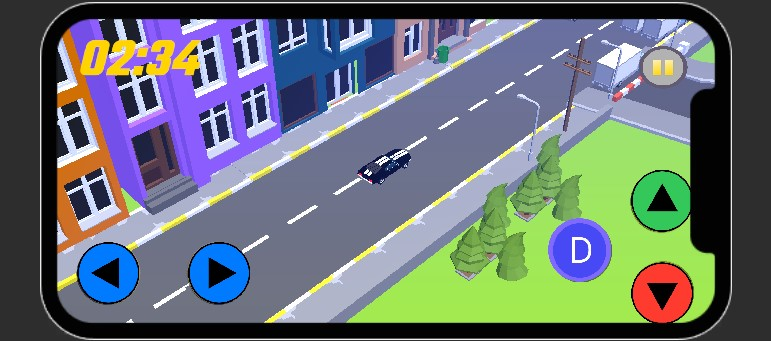

# Gridlock Rush: A Car Simulator Game

## Game Overview

**Gridlock Rush** is an engaging car simulation game where players navigate through challenging traffic scenarios. Test your driving skills, solve puzzles, and experience the thrill of overcoming gridlocks in style.

## Key Features

- **Low-Poly Style**  
  A charming and visually appealing low-poly art style designed for mobile platforms.

- **Easy and Fun Gameplay**  
  Enjoy an intuitive, easy-to-learn driving experience that’s perfect for players of all ages.

- **Realistic Traffic Simulation**  
  Navigate through dynamically changing traffic conditions while solving fun and engaging challenges.

- **Time Trial Mode**  
  Race against the clock to complete levels as quickly as possible, testing your driving skills under pressure.

- **Level System**  
  Progress through levels with increasing difficulty, unlocking new challenges and rewards as you advance.

- **Intuitive Controls**  
   Simple, responsive controls that make it easy for players to jump right in and enjoy the game.
  

## Game Details

- **Title**: Gridlock Rush
- **Version**: 1.0.0
- **Platform**: Android
- **Developer**: OPCD STUDIO
- **Release Date**: Coming soon on the Play Store!

## How to Play

1. Choose a game mode from the main menu.
2. Navigate through the traffic to reach your destination or solve the given puzzle.
3. Use in-game currency to unlock new cars and upgrades.
4. Progress through levels to unlock harder challenges.

## System Requirements

### Minimum:

- **OS**: Windows 7/10, macOS 10.12
- **Processor**: Dual-core 2.0 GHz
- **Memory**: 4 GB RAM
- **Graphics**: Integrated GPU
- **Storage**: 500 MB available space

### Recommended:

- **OS**: Windows 10, macOS 11
- **Processor**: Quad-core 3.0 GHz
- **Memory**: 8 GB RAM
- **Graphics**: Dedicated GPU (2 GB VRAM)
- **Storage**: 1 GB available space

## Development Roadmap

- **Future Updates**: Plans for multiplayer mode, new cars, and additional environments.
- **Player Feedback**: Your suggestions will shape upcoming features.

## Visual Insights

## Support

For assistance, reach out to our support team at [support email] or visit our [website link].

## Conclusion

Get ready to dive into the ultimate car simulation experience with **Gridlock Rush**. Master traffic puzzles, showcase your driving skills, and enjoy endless hours of fun!

